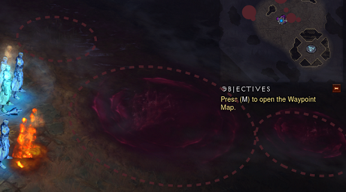
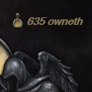
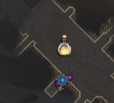
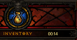
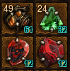
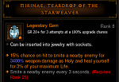

# Resu
Turbo.Plugins.Resu
```diff
+ Right Click -> Save As -> plugins/Resu/

```


#### [BattleTagAboveBannerPlugin.cs](https://github.com/User5981/Resu/blob/master/BattleTagAboveBannerPlugin.cs) - Adds other players' battletags above banners when they aren't in town. 
#### [BloodSpringsPlugin.cs](https://github.com/User5981/Resu/blob/master/BloodSpringsPlugin.cs) - Adds Circles around Blood springs on the floor and on the minimap (Paths of the Drowned & Blood Marsh area).

#### [CraftCountPlugin.cs](https://github.com/User5981/Resu/blob/master/CraftCountPlugin.cs) - Displays total amount of :
- Death's breath
- Veiled Crystal 
- Blood Shards 
- Reusable Parts
- Arcane Dust 
- Forgotten Soul
- Greater rift Keystone
- Bovine Bardiche
- Puzzle Ring
- Hellfire crafts
- Bounty crafts 

 ...near resource globe when total amount changes.
#### [CraftersDelightPlugin.cs](https://github.com/User5981/Resu/blob/master/CraftersDelightPlugin.cs) - Shows on mini map :	
- Death's Breath 
- Veiled Crystal 
- Arcane Dust 
- Forgotten Soul 
- Bovine Bardiche 
- Puzzle Ring 
- Reusable Parts
- Gems (Marquise and Imperial only)
- Greater Rift Keystone
- Blood Shards
- ramaladni's gift
- potions
- infernal machines
- Bounty crafts
- Hellfire crafts
- legendary gems
- Horadric Caches
- Ancient and Primal indicator on legendary or set icons (minimap).

...And adds transparent colored groundlabel names with quantity for all + Slain Farmers (discrete and ground label only) except Bovine Bardiche & Puzzle Ring (already in ItemsPlugin).

  
#### [CustomLifeWarningPlugin.cs](https://github.com/User5981/Resu/blob/master/CustomLifeWarningPlugin.cs) - Turns the screen progressively to transparent orange when life percentage goes under the set limit. Default is 50%.
#### [HuntersVengeancePlugin.cs](https://github.com/User5981/Resu/blob/master/HuntersVengeancePlugin.cs) - Shows 1 circle around your player when you have Zei's stone of vengeance equipped and are fighting, it also displays the percentage of damage increased by the legendary gem under each monster (calculated from gem level and distance from your player).
#### [ImmortalKingsCallPlugin.cs](https://github.com/User5981/Resu/blob/master/ImmortalKingsCallPlugin.cs) - Shows when Immortal King's Call's +1500 damage buff is active and how many seconds are left.
#### [ItemPerfectionPlugin.cs](https://github.com/User5981/Resu/blob/master/ItemPerfectionPlugin.cs) - displays :
- Check mark	: % item perfection
- Crossed swords :	% item offense orientation
- Shield :	% item defense orientation
- Globe :	% item resource orientation
- Heart :	% item life orientation
- Boot :	% item adventure orientation
#### [ParagonPercentagePlugin.cs](https://github.com/User5981/Resu/blob/master/ParagonPercentagePlugin.cs) - Shows EXP percentage with two decimal right to portrait paragon level (a bit more precise than the top stats 2 decimals paragon level) with EXP/h & time to next paragon level in the hint and replaces portrait level 70 (only if reached) by each player's highest Greater Rift level with Class, Sheet DPS, EHP and Nemesis Bracers indicator in the hint.
#### [TimeEverywherePlugin.cs](https://github.com/User5981/Resu/blob/master/TimeEverywherePlugin.cs) - The default clock is hidden when your inventory is open which means you can't read it when spending time with the mystic, the jeweller and the blacksmith. You have 10mn left before going to school/work but can't see the time while you try to roll that good stat for your item? This plugin is for you, it displays time in your inventory when it's open.

#### [UrshisGiftPlugin.cs](https://github.com/User5981/Resu/blob/master/UrshisGiftPlugin.cs) - Adds GR level for n% chance of upgrade on the bottom-right of your legendary gems in your stash and your inventory, maxed Gems are labelled "max", hint in itemhovered menu.The default setting is 100% chance for all 3 consecutive attempts.
 

Customization (paste this in the Customization part of User/PluginEnablerOrDisablerPlugin.cs) :
```C#
// Settings for UrshisGift Plugin
               Hud.RunOnPlugin<Resu.UrshisGiftPlugin>(plugin => 
            { 
                plugin.ChanceWantedPercentage = 100;  // % chance wanted : 100; 90; 80; 70; 60; 30; 15; 8; 4; 2; 1;
                plugin.NumberOfAttempts = 3;        // Number of consecutive attempts at this % : 1; 2; 3; (default) 4; (empowered GRift or no-death bonus) 5; (empowered GRift + no-death bonus)
                plugin.InventoryNumbers = true;    //show GRift level advised for the gem in inventory, stash, set to true; or false;
                plugin.HoveredNumbers = true;     //show upgrade hint on item hovered, set to true; or false;
            
            });  
             // End of Settings for UrshisGift Plugin
```
