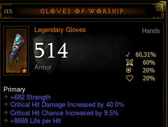

# Resu
Turbo.Plugins.Resu
```diff
+ Click to download zip-> unzip -> Save As -> plugins/Resu/

```


#### [BattleTagAboveBannerPlugin.cs](https://minhaskamal.github.io/DownGit/#/home?url=https://github.com/User5981/Resu/blob/master/BattleTagAboveBannerPlugin.cs) - Adds other players' battletags above banners when they aren't in town. 
#### [DangerPlugin.cs](https://minhaskamal.github.io/DownGit/#/home?url=https://github.com/User5981/Resu/blob/master/DangerPlugin.cs) - Adds : 
Note : [HotEnablerDisablerPlugin.cs](https://minhaskamal.github.io/DownGit/#/home?url=https://github.com/User5981/Resu/blob/master/HotEnablerDisablerPlugin.cs) is now MANDATORY to use this plugin.
- Circles around Blood springs on the floor and on the minimap (Paths of the Drowned & Blood Marsh area)(previously BloodSpringsPlugin).
- Circles around Shock Towers on the floor and on the minimap (from DM's ShockTowerPlugin).
- Circles around Demon Forges on the floor and on the minimap (from DM's DemonForgePlugin).
- Circles around Arcane enchanted.
- Circles around Demon Mines.
- Circles under Orbiters within 10 yards.
- Thunderstorm, Plagued, Molten, PoisonDeath, MoltenExplosion, Morlu's Meteor & Desecrator move! warnings when player is exposed.
- Crosses on the ground for poison enchanted.
- SandWasp's Projectile indicator. 


Customization (paste this in the Customization part of User/PluginEnablerOrDisablerPlugin.cs) :
```C#
// DangerPlugin Customization
               Hud.RunOnPlugin<Resu.DangerPlugin>(plugin => 
            { 
               // set to false; the items you don't want to see 
            plugin.BloodSprings = true; 
            plugin.DemonicForge = true;
            plugin.ShockTower = true;
            plugin.Desecrator = true;
            plugin.Thunderstorm = true;
            plugin.Plagued = true;
            plugin.Molten = true;
            plugin.ArcaneEnchanted = true;
            plugin.PoisonEnchanted = true;
			plugin.GasCloud = true; // (Ghom)
			plugin.SandWaspProjectile = true;
			plugin.MorluSpellcasterMeteorPending = true;
			plugin.DemonMine = true;
			plugin.PoisonDeath = true;
			plugin.MoltenExplosion = true;
			plugin.Orbiter	= true;
            });  
// End of DangerPlugin Customization
```
#### [CraftCountPlugin.cs](https://minhaskamal.github.io/DownGit/#/home?url=https://github.com/User5981/Resu/blob/master/CraftCountPlugin.cs) - Displays total amount of :
- Death's breath
- Veiled Crystal 
- Blood Shards 
- Reusable Parts
- Arcane Dust 
- Forgotten Soul
- Greater rift Keystone
- Bovine Bardiche
- Puzzle Ring
- Hellfire crafts
- Bounty crafts 

 ...near resource globe when total amount changes.
#### [CraftersDelightPlugin.cs](https://minhaskamal.github.io/DownGit/#/home?url=https://github.com/User5981/Resu/blob/master/CraftersDelightPlugin.cs) - Shows on mini map :	
- Death's Breath 
- Veiled Crystal 
- Arcane Dust 
- Forgotten Soul 
- Bovine Bardiche 
- Puzzle Ring 
- Reusable Parts
- Gems (Marquise and Imperial only)
- Greater Rift Keystone
- Blood Shards
- ramaladni's gift
- potions
- infernal machines
- Bounty crafts
- Hellfire crafts
- legendary gems
- Horadric Caches
- Item not yet cubed (minimap)
- Ancient and Primal indicator on legendary or set icons (minimap).

...And adds transparent colored groundlabel names with quantity for all + Slain Farmers (discrete and ground label only) except Bovine Bardiche & Puzzle Ring (already in ItemsPlugin).

  

Advice: For better experience with this plugin, turn off "Always Show Items Labels On Drop" in the Diablo 3 Gameplay options.

Customization (paste this in the Customization part of User/PluginEnablerOrDisablerPlugin.cs) :
```C#
// CraftersDelightPlugin Customization
               Hud.RunOnPlugin<Resu.CraftersDelightPlugin>(plugin => 
            { 
               // set to false; the items you don't want to see 
            plugin.ShowAncientRank = true; 
            plugin.SlainFarmers = true;
            plugin.DeathsBreath = true;
            plugin.VeiledCrystal = true;
            plugin.ArcaneDust = true;
            plugin.Gems = true;
            plugin.ForgottenSoul = true;
            plugin.ReusableParts = true;
            plugin.GreaterRiftKeystone = true;
            plugin.BovineBardiche = true;
            plugin.PuzzleRing = true;
            plugin.BloodShards = true;
            plugin.RamaladnisGift = true;
            plugin.Potion = true;
            plugin.InfernalMachine = true;
            plugin.Bounty = true;
            plugin.HellFire = true;
            plugin.LegendaryGems = true;
            plugin.HoradricCache = true;

            });  
// End of CraftersDelightPlugin Customization
```
#### [CustomLifeWarningPlugin.cs](https://minhaskamal.github.io/DownGit/#/home?url=https://github.com/User5981/Resu/blob/master/CustomLifeWarningPlugin.cs) - Turns the screen progressively to transparent orange when life percentage goes under the set limit. Default is 50%.


Customization (paste this in the Customization part of User/PluginEnablerOrDisablerPlugin.cs) :
```C#
// Settings for Custom Life Warning Plugin
               Hud.RunOnPlugin<Resu.CustomLifeWarningPlugin>(plugin => 
            { 
                    // Set the life % limit under which you want the warning
                     plugin.lifePercentage = 50;
                    
            
            });  
// End of Settings for Custom Life Warning Plugin
```
#### [HuntersVengeancePlugin.cs](https://minhaskamal.github.io/DownGit/#/home?url=https://github.com/User5981/Resu/blob/master/HuntersVengeancePlugin.cs) - Shows 1 circle around your player when you have Zei's stone of vengeance equipped and are fighting, it also displays the percentage of damage increased by the legendary gem under each monster (calculated from gem level and distance from your player), the circle and a visor appears on the minimap to help you to aim at distant monsters.
 

Customization (paste this in the Customization part of User/PluginEnablerOrDisablerPlugin.cs) :
```C#
// Settings for Hunter's Vengeance Plugin
               Hud.RunOnPlugin<Resu.HuntersVengeancePlugin>(plugin => 
            { 
                    // Disable the plugin for a class : Set it to false;
                   // Enable permanent circle : Set it to true;
                     plugin.DemonHunter = true;
                     plugin.Barbarian = true;
                     plugin.Wizard = true;
                     plugin.WitchDoctor = true;
                     plugin.Monk = true;
                     plugin.Crusader = true;
                     plugin.Necromancer = true;
                     plugin.permanentCircle = false;
                     plugin.ElitesOnlyNumbers = false;
            });  
// End of Settings for Hunter's Vengeance Plugin
```
#### [ImmortalKingsCallPlugin.cs](https://minhaskamal.github.io/DownGit/#/home?url=https://github.com/User5981/Resu/blob/master/ImmortalKingsCallPlugin.cs) - Shows when Immortal King's Call's +1500 damage buff is active and how many seconds are left.

#### [ItemPerfectionPlugin.cs](https://minhaskamal.github.io/DownGit/#/home?url=https://github.com/User5981/Resu/blob/master/ItemPerfectionPlugin.cs) - displays :
- Check mark	: % item perfection
- Crossed swords :	% item offense orientation
- Shield :	% item defense orientation
- Globe :	% item resource orientation
- Heart :	% item life orientation
- Boot :	% item adventure orientation


#### [ParagonPercentagePlugin.cs](https://minhaskamal.github.io/DownGit/#/home?url=https://github.com/User5981/Resu/blob/master/ParagonPercentagePlugin.cs) - Shows EXP percentage with two decimal right to portrait paragon level (a bit more precise than the top stats 2 decimals paragon level) with EXP/h & time to next paragon level in the hint and replaces portrait level 70 (only if reached) by each player's highest Greater Rift level with Class, Sheet DPS, EHP and Nemesis Bracers [N] & Unity [U] indicator in the hint.


Customization (paste this in the Customization part of User/PluginEnablerOrDisablerPlugin.cs) :
```C#
// Display % on the left for Paragon Percentage Plugin
               Hud.RunOnPlugin<Resu.ParagonPercentagePlugin>(plugin => 
            { 
                plugin.ParagonPercentageOnTheRight = false; 
            });  
// End of Display % on the left for Paragon Percentage Plugin
      
      
// Disable GR level display for Paragon Percentage Plugin
Hud.RunOnPlugin<Resu.ParagonPercentagePlugin>(plugin => 
            { 
                plugin.ShowGreaterRiftMaxLevel = false; 
            }); 
// End of Disable GR level display for Paragon Percentage Plugin


 // Disable Top Experience Statistics
                           Hud.TogglePlugin<TopExperienceStatistics>(false); 
 // End of Disable Top Experience Statistics
```
#### [TimeEverywherePlugin.cs](https://minhaskamal.github.io/DownGit/#/home?url=https://github.com/User5981/Resu/blob/master/TimeEverywherePlugin.cs) - The default clock is hidden when your inventory is open which means you can't read it when spending time with the mystic, the jeweller and the blacksmith. You have 10mn left before going to school/work but can't see the time while you try to roll that good stat for your item? This plugin is for you, it displays time in your inventory when it's open.

#### [UrshisGiftPlugin.cs](https://minhaskamal.github.io/DownGit/#/home?url=https://github.com/User5981/Resu/blob/master/UrshisGiftPlugin.cs) - Adds GR level for n% chance of upgrade on the bottom-right of your legendary gems in your stash and your inventory, maxed Gems are labelled "max", hint in itemhovered menu.The default setting is 100% chance for all 3 consecutive attempts.
```diff
-  Press F3 to update data after a GRift.
```
 

Customization (paste this in the Customization part of User/PluginEnablerOrDisablerPlugin.cs) :
```C#
// Settings for UrshisGift Plugin
               Hud.RunOnPlugin<Resu.UrshisGiftPlugin>(plugin => 
            { 
                plugin.ChanceWantedPercentage = 100;  // % chance wanted : 100; 90; 80; 70; 60; 30; 15; 8; 4; 2; 1;
                plugin.NumberOfAttempts = 3;        // Number of consecutive attempts at this % : 1; 2; 3; (default) 4; (empowered GRift or no-death bonus) 5; (empowered GRift + no-death bonus)
                plugin.InventoryNumbers = true;    //show GRift level advised for the gem in inventory, stash, set to true; or false;
                plugin.HoveredNumbers = true;     //show upgrade hint on item hovered, set to true; or false;
            
            });  
// End of Settings for UrshisGift Plugin
```

#### [HotEnablerDisablerPlugin.cs](https://minhaskamal.github.io/DownGit/#/home?url=https://github.com/User5981/Resu/blob/master/HotEnablerDisablerPlugin.cs) - This plugin allows you to disable a plugin by :
- Hero is Softcore
- Hero is Hardcore
- Hero class
- Hero Name

The plugin developper has just to add these (unchanged) three lines at the begining of the rendering part to make it compatible, (thereafter the plugin will throw an exception if this plugin is not present) :
```C#
var hedPlugin = Hud.GetPlugin<HotEnablerDisablerPlugin>();
bool GoOn = hedPlugin.CanIRun(Hud.Game.Me,this.GetType().Name); 
if (!GoOn) return;
```
Customization (paste this in the Customization part of User/PluginEnablerOrDisablerPlugin.cs) :
```C#
// Settings for Hot Enabler/Disabler Plugin
// One line per plugin, case sensitive 
               Hud.RunOnPlugin<Resu.HotEnablerDisablerPlugin>(plugin => 
            { 
		plugin.DisableThis.Add("NameOfThePlugin","Hardcore"); // This disables the plugin NameOfThePlugin for all Hardcore Heroes. 1 entry possible, 2 options : Hardcore Softcore  
		plugin.DisableThis.Add("NameOfThePlugin","DemonHunter"); // This disables the plugin NameOfThePlugin for all DemonHunter Heroes. Many entries possible for one plugin, separated by spaces : DemonHunter Barbarian Wizard WitchDoctor Monk Crusader Necromancer 
		plugin.DisableThis.Add("NameOfThePlugin","IncredibleMe"); // This disables the plugin NameOfThePlugin for the Hero named IncredibleMe. Many entries possible for one plugin, separated by spaces. 
		});	
// End of Settings for Hot Enabler/Disabler Plugin
```
